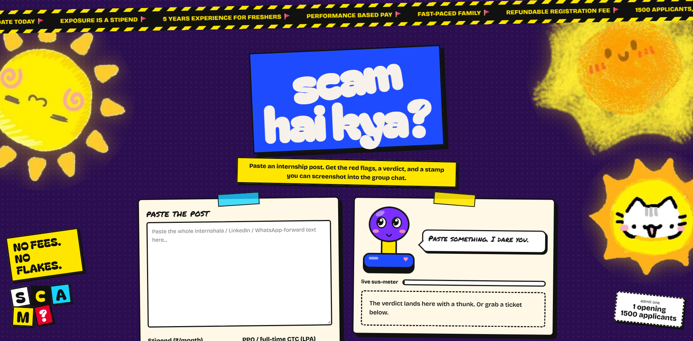
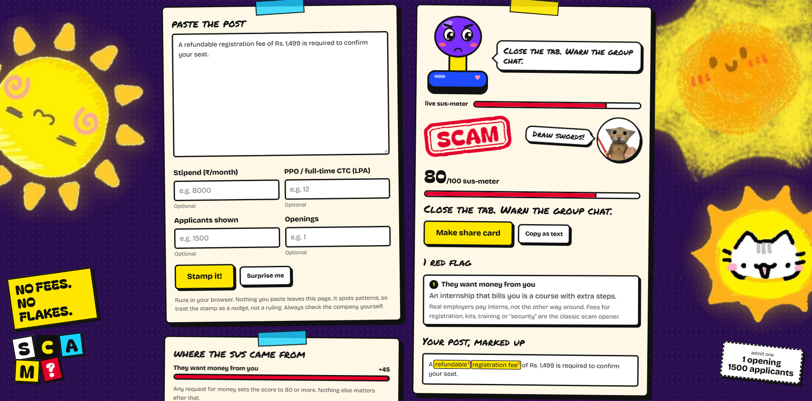
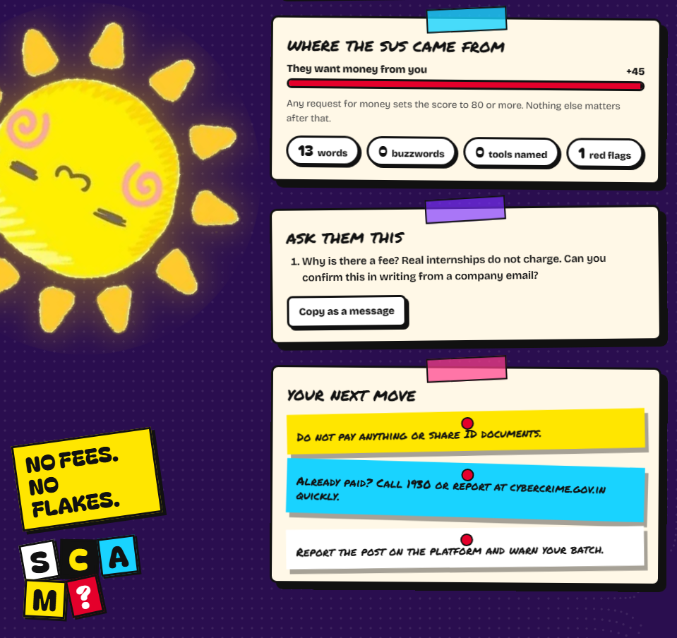
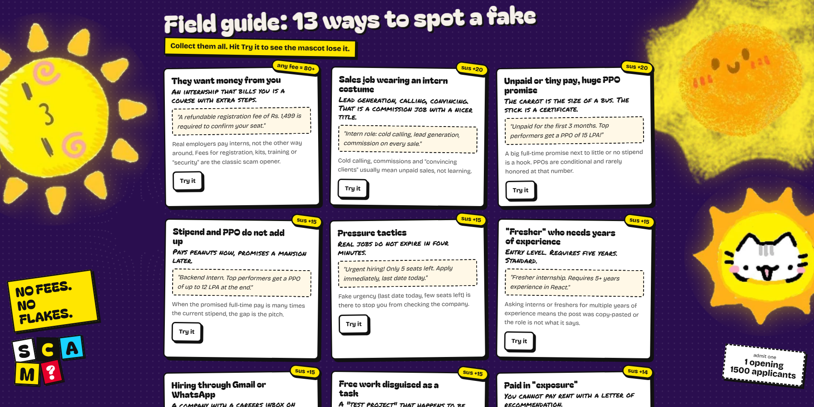
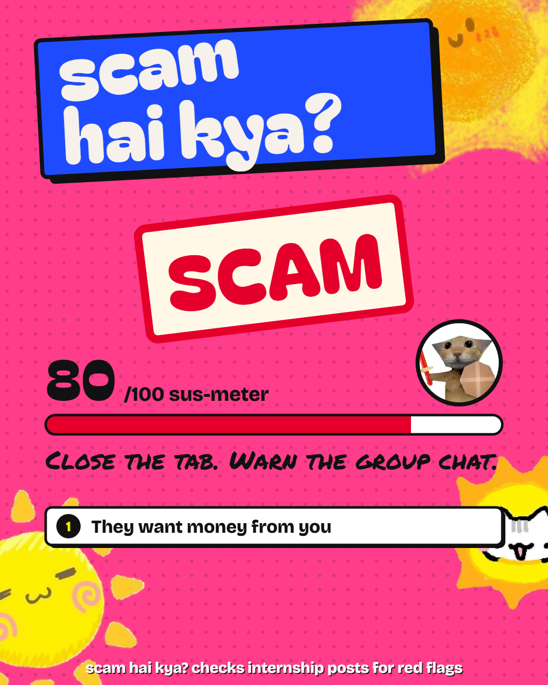
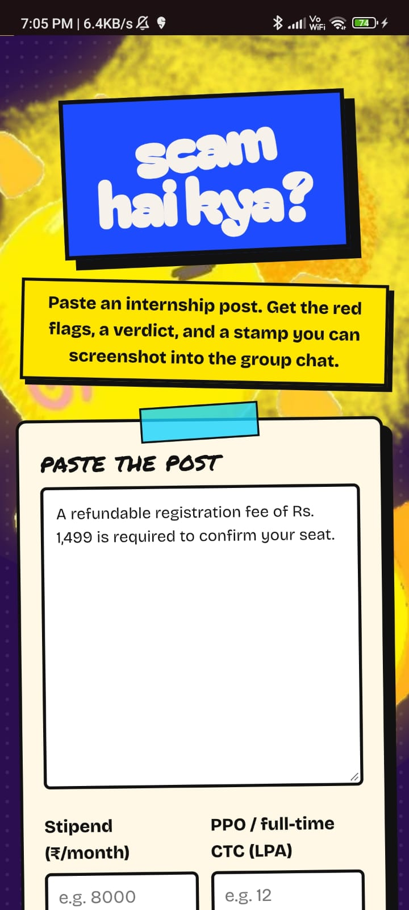

<h1 align="center">Scam Hai Kya?</h1>

<p align="center"><b>Paste an internship post. Get the red flags, a sus score, and a rubber stamp you can screenshot into the group chat.</b></p>

<p align="center">
  <a href="https://scam-hai-kya.vercel.app/"></a>
  
  
</p>

<p align="center">
  <a href="https://scam-hai-kya.vercel.app/">
    
  </a>
</p>

<p align="center"><a href="https://scam-hai-kya.vercel.app/"><b>Try it live</b></a> &nbsp;|&nbsp; runs entirely in your browser &nbsp;|&nbsp; nothing you paste leaves the page</p>

<p align="center">
  
</p>

---

## Why this exists

Every internship hunt in India ends up with a few posts that are really a registration fee, a sales job in an intern costume, or an unpaid role with a "PPO of 15 LPA" dangling off it. After enough of them you start to see the same patterns. This tool is that pattern recognition, in a box: it highlights the exact phrases that look wrong, explains why, and tells you what to ask the recruiter.

## What it does

<table>
  <tr>
    <td width="50%" valign="top">
      
      <br><b>Verdict stamp</b><br>
      LEGIT-ISH, KINDA SUS, LIKELY SCAM or SCAM, delivered by an animated rubber stamp. A verdict buddy reacts: Kirby for fine, a blep cat for sus, a sword cat for scams.
    </td>
    <td width="50%" valign="top">
      
      <br><b>Case file</b><br>
      Where every point came from, questions to ask the recruiter (with a copy-as-message button), and next steps that change with the verdict.
    </td>
  </tr>
  <tr>
    <td width="50%" valign="top">
      
      <br><b>Field guide</b><br>
      All 13 red flags as collectible cards, each with a real example and a "Try it" button that loads it so you can see the score move.
    </td>
    <td width="50%" valign="top">
      
      <br><b>Share card</b><br>
      One click makes a 1080x1350 PNG of your verdict, sized for a WhatsApp status or an Instagram story.
    </td>
  </tr>
</table>

Also in the box:

- **Live reactions.** The mascot and a sus-meter update while you type or paste, before you press anything.
- **Highlighted post.** Every matched phrase is marked in your text with a number that matches its flag.
- **Sample tickets.** Six ready-made sus posts, plus a "Surprise me" button.
- **A repelling dot background.** The halftone dots run away from your cursor. It is purely for fun.

<p align="center">
  
</p>

## A worked example

Paste this (it is the built-in "The Fee Trap" ticket, shortened):

```text
URGENT HIRING!! Dynamic Rockstar Interns needed for a fast-paced, passionate family.
Stipend: ₹2,000 - ₹40,000 (performance based, incentives on every lead)
Perks: Certificate + Letter of recommendation + great exposure. Top performers get a PPO of 12 LPA!
A refundable registration fee of Rs. 1,499 is required to confirm your seat.
Only 5 seats left, apply immediately, last date today.
Send your resume to hrteam.careers123@gmail.com or WhatsApp us now.
```

Result: **SCAM, 100 / 100, 12 red flags.** The top three are "They want money from you", "Sales job wearing an intern costume" and "Unpaid or tiny pay, huge PPO promise".

Now the opposite: the built-in "Actually Fine" ticket (a backend internship with a stated stipend, named tools and a mentor) scores **0 / 100, LEGIT-ISH**, with three green flags.

## How scoring works

Each rule that matches adds its points. Green flags (a clearly stated stipend, named tools, mentorship) subtract up to 12. The score is clamped to 0 to 100. **Any request for money sets a floor of 80**, because no legitimate internship charges you.

| Red flag | Points |
| --- | --- |
| They want money from you | +45 |
| Sales job wearing an intern costume | +20 |
| Unpaid or tiny pay, huge PPO promise | +20 |
| Stipend and PPO do not add up | +15 |
| Pressure tactics | +15 |
| "Fresher" who needs years of experience | +15 |
| Hiring through Gmail or WhatsApp | +15 |
| Free work disguised as a task | +15 |
| Paid in "exposure" | +14 |
| Absurd applicants per opening | +12 |
| Salary range wide enough to park a truck in | +12 |
| Buzzword soup | +12 |
| No actual work described | +10 |

Verdict bands: **0 to 19** LEGIT-ISH, **20 to 39** KINDA SUS, **40 to 64** LIKELY SCAM, **65 to 100** SCAM.

The optional fields feed two extra checks: the PPO-versus-stipend gap and the applicants-per-opening ratio.

## Limits (please read)

This is pattern matching, not machine learning, and it is tuned for English-language Indian internship posts. It will miss clever scams and can flag an honest post that happens to use buzzwords. Treat the stamp as a nudge, not a ruling, and always check the company yourself: LinkedIn, reviews, and the MCA website. If you have already paid a scammer in India, call **1930** or report at **cybercrime.gov.in**.

## Run it locally

It is a single HTML file with no build step and no dependencies.

```bash
git clone https://github.com/thorrwho/scam-hai-kya.git
cd scam-hai-kya

# just open it
open index.html            # macOS (xdg-open on Linux, start on Windows)

# or serve it
python3 -m http.server 8000
```

Fonts (Bagel Fat One, Bricolage Grotesque, Permanent Marker) load from Google Fonts, with system fallbacks if you are offline.

## Deploy

It is a static page, so any static host works. The live version runs on **Vercel** with every build setting left empty. GitHub Pages and Netlify work the same way: no build command, no environment variables, no server.

## Add or tune a rule

Rules live in the `RULES` array in `index.html`. Each has an id, a weight, a title, a one-liner, an explanation, and a `find` function that returns whether it matched and which character spans to highlight.

```js
{id:'urgent', w:15, title:'Pressure tactics',
  snark:'Real jobs do not expire in four minutes.',
  why:'Fake urgency is there to stop you from checking the company.',
  find:rx(/urgent(?:ly)?|apply (?:immediately|now)|last date today/gi)}
```

If you add a rule, also add an example sentence to the `EX` object so it shows up in the field guide with a working "Try it" button.

## Project structure

```text
scam-hai-kya/
├── index.html            the whole app (HTML, CSS, JS, and inlined art)
├── docs/screenshots/     images used by this README
├── README.md
├── LICENSE               MIT, for the code
└── NOTICE.md             third-party art credits
```

## Ideas for later

Not promises, just things worth trying:

- A "scammiest post of the week" board where people submit stamped posts anonymously.
- Hinglish and Hindi patterns.
- A browser extension that scans the posts you are already scrolling.
- Official-source lookup links for the company named in the post.

## Built with

Vanilla HTML, CSS and JavaScript, plus the Canvas API for the repelling dot background and the share card. Vibe-coded in a weekend with Claude, then tested in a headless browser.

## License and credits

Code is MIT (see [`LICENSE`](LICENSE)). The character art and clips embedded in the page are third-party and are **not** covered by that license (see [`NOTICE.md`](NOTICE.md)).

Fonts are loaded from Google Fonts under the SIL Open Font License.

---

<p align="center">Built by <b>Saheel</b> &nbsp;|&nbsp; <a href="https://github.com/thorrwho">GitHub</a> &nbsp;|&nbsp; <a href="https://www.linkedin.com/in/saheel-447885373">LinkedIn</a></p>
